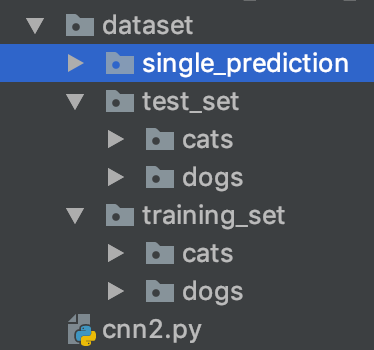

# Dog-Cat-Classifier-
A simple convolutional neural network, trained over a training set of 8000 and a test set of 2000 classified images 
to differentiate between images of dogs and cats. 

The program uses Keras and Tensorflow framework backends to compile and execute the neural network, which has a total
of 3 convolutional layers. 

### Training and Test sets

The training and test sets for the program are structured within the same project folder for easy access. 
The structure of the training and test sets is as follows.

 
